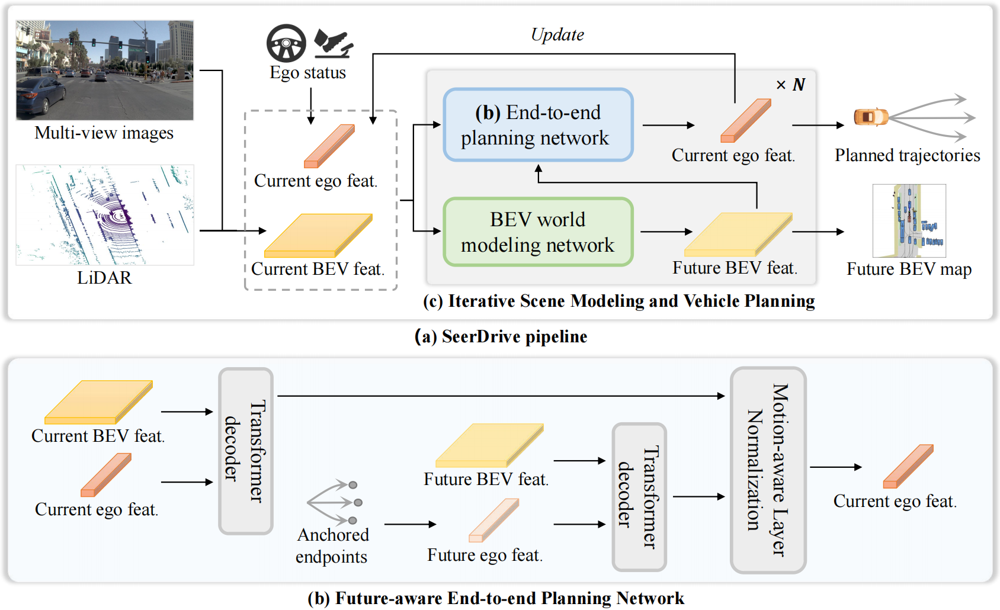
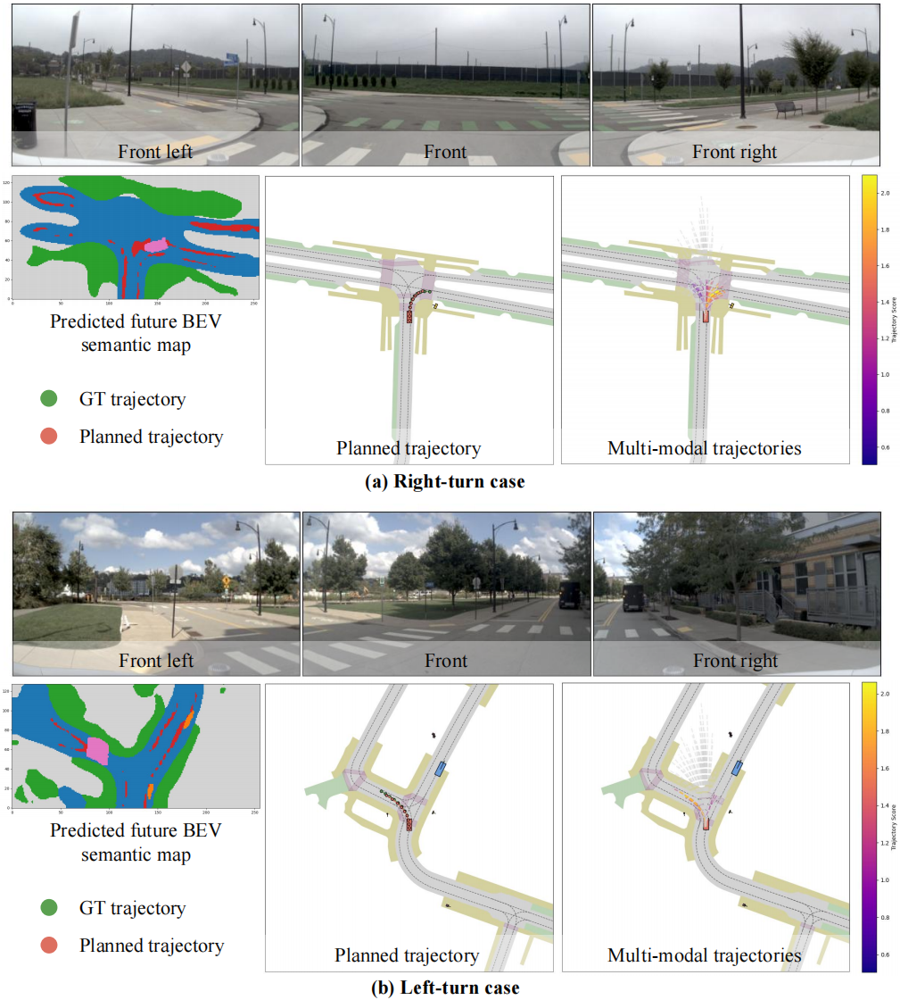

# Future-Aware End-to-End Driving: Bidirectional Modeling of Trajectory Planning and Scene Evolution
### [[Paper]](https://arxiv.org/abs/2510.11092)

> [**Future-Aware End-to-End Driving: Bidirectional Modeling of Trajectory Planning and Scene Evolution**](https://arxiv.org/abs/2510.11092)            
> [Bozhou Zhang](https://zbozhou.github.io/), [Nan Song](https://scholar.google.com/citations?hl=zh-CN&user=wLZVtjEAAAAJ), [Jingyu Li](https://github.com/Whale-ice), [Xiatian Zhu](https://scholar.google.com/citations?user=ZbA-z1cAAAAJ&hl=en), [Jiankang Deng](https://scholar.google.com/citations?user=Z_UoQFsAAAAJ&hl=zh-CN), [Li Zhang](https://lzrobots.github.io)   
> **NeurIPS 2025**

## Abstract
End-to-end autonomous driving methods aim to directly map raw sensor inputs to future driving actions such as planned trajectories, bypassing traditional modular pipelines. While these approaches have shown promise, they often operate under a one-shot paradigm that relies heavily on the current scene context, potentially underestimating the importance of scene dynamics and their temporal evolution. This limitation restricts the model’s ability to make informed and adaptive decisions in complex driving scenarios. We propose a new perspective: the future trajectory of an autonomous vehicle is closely intertwined with the evolving dynamics of its environment, and conversely, the vehicle’s own future states can influence how the surrounding scene unfolds. Motivated by this bidirectional relationship, we introduce **SeerDrive**, a novel end-to-end framework that jointly models future scene evolution and trajectory planning in a closed-loop manner. Our method first predicts future bird’s-eye view (BEV) representations to anticipate the dynamics of the surrounding scene, then leverages this foresight to generate future-context-aware trajectories. Two key components enable this: (1) future-aware planning, which injects predicted BEV features into the trajectory planner, and (2) iterative scene modeling and vehicle planning, which refines both future scene prediction and trajectory generation through collaborative optimization. Extensive experiments on the NAVSIM and nuScenes benchmarks show that SeerDrive significantly outperforms existing state-of-the-art methods. 

## News
- 2025-10, we release SeerDrive. We update the code by integrating the online trajectory evaluation and selection process proposed in [WoTE](https://github.com/liyingyanUCAS/WoTE), achieving a PDMS of 88.88 without the iterative interaction between the planning and scene modeling processes.

## Pipeline
<div align="center">
  
</div><br/>

## Install the environment
The environment is installed following [DiffusionDrive](https://github.com/hustvl/DiffusionDrive), and a reference procedure is provided here.
```
git clone git@github.com:LogosRoboticsGroup/SeerDrive.git

conda env create -f environment.yml
conda activate navsim_seerdrive

git clone git@github.com:motional/nuplan-devkit.git
cd nuplan-devkit/
pip install -e .

cd SeerDrive/
pip install -e .

pip install diffusers einops 
pip install rich==14.0.0
```

## Prepare the data
1. Please follow the official [NAVSIM](https://github.com/autonomousvision/navsim) repository to prepare the dataset.
2. Please follow [WoTE](https://github.com/liyingyanUCAS/WoTE) or use the commands below to preprocess the dataset.
```
python scripts/misc/k_means_trajs.py
bash scripts/misc/gen_pdm_score.sh
bash scripts/evaluation/run_metric_caching.sh
```

## Training and testing
```
# train
bash scripts/training/seerdrive_train.sh

# testing
bash scripts/training/seerdrive_eval.sh
```

## Results and checkpoints
| NC   | DAC  | EP   | TTC  | Comfort | PDMS | Checkpoint |
|:----:|:----:|:----:|:----:|:-------:|:----:|:----------:|
| **98.6** | **97.1** | **82.5** | **95.2** | **100.0**  | **88.9** | [Download](https://drive.google.com/file/d/1CvFsVnMhJCHZ21rTFcOKkgHHrJjteXLb/view?usp=sharing) |

## Qualitative Results
<div align="center">
  
</div><br/>

## BibTeX
```bibtex
@inproceedings{zhang2025seerdrive,
 title={Future-Aware End-to-End Driving: Bidirectional Modeling of Trajectory Planning and Scene Evolution},
 author={Zhang, Bozhou and Song, Nan and Li, Jingyu and Zhu, Xiatian and Deng, Jiankang and Zhang, Li},
 booktitle={NeurIPS},
 year={2025},
}
```

## Acknowledgements
- [NAVSIM](https://github.com/autonomousvision/navsim)
- [DiffusionDrive](https://github.com/hustvl/DiffusionDrive)
- [WoTE](https://github.com/liyingyanUCAS/WoTE)
- [SSR](https://github.com/PeidongLi/SSR)
